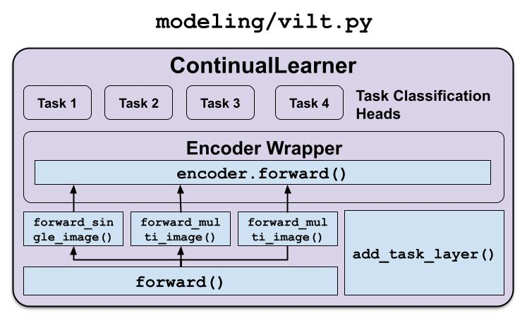

# Adding New Models to CLiMB

CLiMB can be easily extended to include new models (pre-trained Vision-Language encoders) by defining the model in the form of a `ContinualLeaner` class, in `modeling/<model>.py`.

Classes in purple, methods in blue

## `EncoderWrapper`

The `EncoderWrapper` class acts as a wrapper around the pre-trained vision-language encoder model. 
In our case, the encoder `self.vilt` was an instance of the Huggingace [ViltModel](https://huggingface.co/docs/transformers/model_doc/vilt#transformers.ViltModel) class.

The `EncoderWrapper`'s `forward()` function in turn calls the pre-trained VL encoder's `forward()` function.

An example of an EncoderWrapper, `ViltEncoderWrapper`, can be seen [here](src/modeling/vilt.py#L27).

## `ContinualLeaner`

The `ContinualLearner` class is the model that learns the vision-and-language tasks in a continual learning setting. 
It consists of the `EncoderWrapper` module, followed by classification heads for each task (each head added by the `add_task_layer()` method.

An example of a ContinualLeaner, `ViltContinualLeaner`, can be seen [here](src/modeling/vilt.py#L144).

## Methods Required:

### `convert_batch_to_inputs_dict()`

This is a method that converts the batch dictionary, returned by `task_batch_collate` methods (such as [this one](src/data/visionlanguage_datasets/snli_ve_dataset.py#L187)) into an input dictionary that the Encoder can consume (for instance, `ViltModel` takes a list of text strings and list of PIL Images, which are initially encoded using `ViltProcessor` before being passed into the ViltModel).

An example of `convert_batch_to_inputs_dict` can be seen [here](src/modeling/vilt.py#L529).

### `create_continual_learner_model()`

This method loads the pre-trained VL model, and creates a `ContinualLearner` model with the VL encoder and task heads.

An example can be seen [here](src/modeling/vilt.py#L497).

### Additional Changes

Some models, such as those requiring visual region features, require modifications to the tasks as well, including the `TaskDataset` class, `task_batch_collate` methods and `TaskTrainer` classes. More details on these classes can be found in the [ADD_NEW_TASKS.md](ADD_NEW_TASKS.md) guide.
