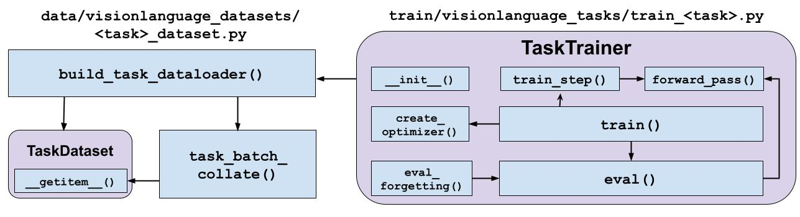

# Adding New Tasks to CLiMB

## Adding New Multimodal Tasks to CLiMB

Multimodal tasks in CLiMB Adding new tasks to CLiMB consists of three main components:
1. Data Processing:  TaskDataset class and `build_task_dataloader()` method in `data/visionlanguage_datasets/<task>_dataset.py`
2. Creating the task trainer: TaskTrainer class in `train/visionlanguage_tasks/<task>_trainer.py`
3. Adding task configuration and parameters to `configs/task_configs.py`

This figure shows how the various classes and methods for adding a new task are structured, with arrows indicating which methods call which other methods and instantiate other classes.

---
### 1. Data Processing: `data/visionlanguage_datasets/<task>_dataset.py`

In `data/visionlanguage_datasets/<task>_dataset.py`, you have to create: 
- a `TaskDataset` class,
- `task_batch_collate()` method, and
- `build_task_dataloader()` method 

i. <b>`TaskDataset`</b>: This is a [torch.utils.data.Dataset](https://pytorch.org/docs/stable/data.html#torch.utils.data.Dataset) class. The `__init__()` method can take in whatever arguments you want, but should contain at least two arguments:
   - `data_dir`: A string pointing to the location of the task's data files
   - `split`: A sting indicating whether this is a train or val split of the dataset
   - Optional: `images_dataset`, an instance of a Dataset from `data/image_datasets/` which uses a common image dataset. 
   For instance, SNLI-VE uses images from Flickr30k, so its [Dataset](src/data/visionlanguage_datasets/snli_ve_dataset.py#L36) takes an `images_dataset` object belong to the [Flickr30KImagesDataset](src/data/image_datasets/flickr30kimages_dataset.py#L22) dataset, which handles the image processing for all tasks that use Flickr30K images.

   The `TaskDataset` class must have a `__getitem__()` method that returns the text and image inputs (the latter may be retrieved from `images_dataset.get_image_data()` if applicable), and output label, in the form of a dictionary. 
Example can be seen [here](src/data/visionlanguage_datasets/snli_ve_dataset.py#L147).

An example of a `TaskDataset` class for SNLI-VE, the SnliVEDataset class, can be seen [here](src/data/visionlanguage_datasets/snli_ve_dataset.py#L36).

ii. <b>`task_batch_collate()`</b>: This is a method that collates inputs from different instances in a batch into batched inputs and outputs in the form of a dictionary. 
This includes padding of text and image tensors if needed. 
The method's arguments are:
- `batch`: List of dictionaries, each dictionary corresponding to a batch instance, returned from `TaskDataset.__getitem__()`
- `visual_input_type`: a string, indicating the image format that the model takes as input (in the case of ViLT, `visual_input_type='pil-image'`. 
This string is retrieved from the [model configuration file](src/configs/model_configs.py).
Image collation can be done using the `image_collate()` method in `data/image_collation.py`, using the `visual_input_type` argument.

The method returns a dictionary, each item corresponding to a batched input or output item.

An example of a `task_batch_collate` method for SNLI-VE, called `snli_ve_batch_collate`, can be seen [here](src/data/visionlanguage_datasets/snli_ve_dataset.py#L147).
 
iii. <b>`build_task_dataloader()`</b>: This is a method that returns a [torch.utils.data.Dataloader](https://pytorch.org/docs/stable/data.html#torch.utils.data.DataLoader), using an instance of `TaskDataset` and the `task_batch_collate()` method

An example of a `build_task_dataloader` method for SNLI-VE, called `build_snli_ve_dataloader`, can be seen [here](src/data/visionlanguage_datasets/snli_ve_dataset.py#L193).

---
### 2. Creating the task trainer: `train/visionlanguage_tasks/<task>_trainer.py`

In `train/visionlanguage_tasks/<task>_trainer.py`, you have to create a `TaskTrainer` class. The Trainer should ideally be designed to be as model-agnostic as possible.

The TaskTrainer takes `args` from the users, task configurations from [`configs/task_configs.py`](src/configs/task_configs.py) and model configurations from [`configs/model_configs.py`](src/configs/model_configs.py)

`TaskTrainer` has the following methods:
- `__init__()`: creates the train and validation dataloaders (using the `build_task_dataloader()` method from `data/visionlanguage_datasets/<task>_dataset.py`) and sets training hyperparameters.
- `create_optimizer()`: Creates optimizer for training
- `train()`: creates optimizer from `create_optimizer()`, and does training by calling the `train_step()` method (which in turn calls `forward_pass()`.
- `eval_forgetting()`: Called after model has already been trained on this task in the upstream CL phase. Loads a model checkpoint from a future task, and evaluates on this task using `eval()`.
- `eval()`: Evaluation over the validation dataloader. This method is called from the `train()` method after every epoch, and can be used to evaluate forgetting from `eval_forgetting()`.

An example of a `TaskTrainer` for SNLI-VE, called `SNLIVETrainer`, can be seen [here](src/train/visionlanguage_tasks/train_snli_ve.py).

---
### 3. Task Configuration and Parameters: `configs/task_configs.py`

In [`configs/task_configs.py`](src/configs/task_configs.py), you need to create a `<task>_config` dictionary, containing the following keys:
- `task_name`: Name of the task (for display purposes)
- `data_dir`: The directory within the overall data directory containing this task's data
- `image_source` (if applicable): If task dataset uses an `images_dataset` such as MS-COCO or Flickr30K that is shared between tasks
- Learning hyperparameters: `num_epochs`, `lr`, `weight_decay`, `adam_epsilon`, `warmup_ratio`
- `task_trainer`: The `TaskTrainer` class for this task (defined aboe)
- `random_baseline_score`: Performance of a random baseline on this task (as a percentage). Used for computing upstream knowledge transfer scores.

An example of a `task_config` for SNLI-VE, called `snli_ve_config`, can be seen [here](src/configs/task_configs.py#L58).

The `task_config` is then stored in the [`task_configs`](src/configs/task_configs.py#L222) dictionary, with the `task_key` being the key. 
For instance, for SNLI-VE, `task_key = 'snli-ve'`.
