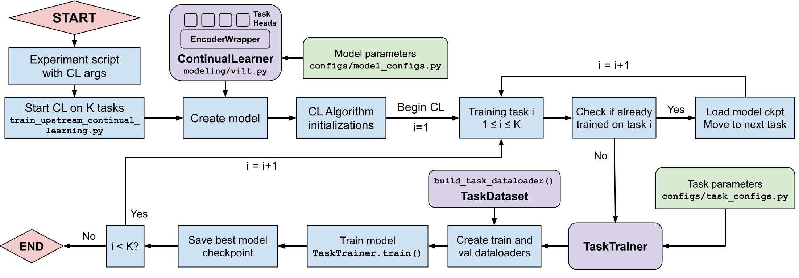

# Training Upstream Continual Learning

Continual Learning experiments can be run using the file `src/train/train_upstream_continual_learning.py`. 
The following arguments need to be specified:

-   `--encoder_name` : Name of base vision-language encoder to use. Available VL encoders can be viewed [here](src/configs/model_configs.py#L4).
-   `--pretrained_model_name` : Name of pre-trained model checkpoint name to load for encoder.
-   `--ordered_cl_tasks` : Order of CL tasks. Tasks available for upstream CL can be seen [here](src/configs/task_configs.py#L6).
-   `--cl_algorithm` : Name of CL algorithm to use. Some algorithms may include additional algorithm-specific arguments
-   `--climb_data_dir` : Directory where the training data for all CLiMB tasks is located
-   `--do_train` and `--do_eval` (latter if only doing Knowledge Transfer/Forgetting evaluation of an already CL-trained model)
-   `--output_dir` : Directory where experiment outputs will be stored.
-   `--batch_size`

The above flowchart shows the steps in training a model on multimodal tasks in a Continual Learning setting.

Sample CL training scripts for training a ViLT encoder on the task order VQAv2 -> NLVR2 -> SNLI-VE -> VCR, using a variety of CL algorithms, can be viewed [here](src/exp_scripts/continual_learning/vqa_nlvr_snlive_vcr/).
